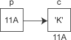

# 指针*

数据在内存中的地址也称为指针，如果一个变量存储了一份数据的指针，我们就称它为指针变量。

在C语言中，允许用一个变量来存放指针，这种变量称为指针变量。指针变量的值就是某份数据的地址，这样的一份数据可以是数组、字符串、函数，也可以是另外的一个普通变量或指针变量。

现在假设有一个 char 类型的变量 c，它存储了字符 'K'（ASCII码为十进制数 75），并占用了地址为 0X11A 的内存（地址通常用十六进制表示）。另外有一个指针变量 p，它的值为 0X11A，正好等于变量 c 的地址，这种情况我们就称 p 指向了 c，或者说 p 是指向变量 c 的指针。



## 定义指针变量

定义指针变量与定义普通变量非常类似，不过要在变量名前面加星号`*`，格式为：
```c++
datatype *name;

//或

datatype *name = value;
```

`*`表示这是一个指针变量，datatype表示该指针变量所指向的数据的类型 。例如：
```c++
int *p1;
```

p1 是一个指向 int 类型数据的指针变量，至于 p1 究竟指向哪一份数据，应该由赋予它的值决定。再如：
```c++
int a = 100;
int *p_a = &a;
```
在定义指针变量 p_a 的同时对它进行初始化，并将变量 a 的地址赋予它，此时 p_a 就指向了 a。值得注意的是，p_a 需要的一个地址，a 前面必须要加取地址符&，否则是不对的。

和普通变量一样，指针变量也可以被多次写入，只要你想，随时都能够改变指针变量的值，请看下面的代码：
```c++
//定义普通变量
float a = 99.5, b = 10.6;
char c = '@', d = '#';
//定义指针变量
float *p1 = &a;
char *p2 = &c;
//修改指针变量的值
p1 = &b;
p2 = &d;
```

`*`是一个特殊符号，表明一个变量是指针变量，定义 p1、p2 时必须带*。而给 p1、p2 赋值时，因为已经知道了它是一个指针变量，就没必要多此一举再带上`*`，后边可以像使用普通变量一样来使用指针变量。**也就是说，定义指针变量时必须带`*`，给指针变量赋值时不能带`*`。**
