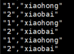
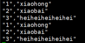

# Flume+Kafka获取MySQL数据

## 摘要
MySQL被广泛用于海量业务的存储数据库，在大数据时代，我们亟需对其中的海量数据进行分析，但在MySQL之上进行大数据分析显然是不现实的，这会影响业务系统的运行稳定。如果我们要实时地分析这些数据，则需要实时地将其复制到适合OLAP的数据系统上。本文介绍一种数据采集工具——Flume，由cloudera软件公司于2009年被捐赠了apache软件基金会，现已成为apache top项目之一。本文使用Flume构建一个对MySQL数据的采集，并投递到Kafka的一个链路。

## 环境依赖
- Java 8+
- Flume 1.9
- Kafka 2.7
- ZooKeeper 3.6
- MySQL 5.7.23
- Git

## 一、下载&打包flume-ng-sql-source插件
### 1、下载
```shell
$ cd /data/gitproject
$ git clone git@github.com:keedio/flume-ng-sql-source.git
$ cd flume-ng-sql-source
$ vim pom.xml

#在
#<build>
#        <plugins>
#内添加如下内容，maven-dependency-plugin是一个可以将当前maven项目所有依赖的jar文件提取到指定文件夹的工具
            <plugin>
                <artifactId>maven-dependency-plugin</artifactId>
                <configuration>
                    <outputDirectory>$FLUME_HOME/lib</outputDirectory>
                    <excludeTransitive>false</excludeTransitive>
                    <stripVersion>true</stripVersion>
                </configuration>
            </plugin>
            ...

# outputDirectory是指定jar包提取路径，表示target目录。如果不写的话，将在根目录下创建lib目录。
# excludeTransitive，表示是否不包含间接依赖的包。
# stripVersion表示复制的jar文件去掉版本信息。

# 执行如下maven命令，所有依赖的jar将提取到lib目录：
$ mvn dependency:copy-dependencies


```

### 2、打包
通过`maven`打jar包：
```shell
# 编译Java项目
$ mvn clean
$ mvn compile
$ mvn package

# 执行完毕后，在./target文件夹下将会有构建好的项目对应的jar包
root@ubuntu-master:/data/gitproject/flume-ng-sql-source/target# ll
total 9088
drwxr-xr-x 11 root root    4096 2月   8 19:53 ./
drwxr-xr-x  5 root root    4096 2月   8 20:21 ../
drwxr-xr-x  3 root root    4096 2月   8 19:53 apidocs/
drwxr-xr-x  3 root root    4096 2月   8 19:50 classes/
-rw-r--r--  1 root root 9163594 2月   8 19:52 flume-ng-sql-source-1.5.3-SNAPSHOT.jar #这个就是我们要的jar包
-rw-r--r--  1 root root   59249 2月   8 19:53 flume-ng-sql-source-1.5.3-SNAPSHOT-javadoc.jar
-rw-r--r--  1 root root   10856 2月   8 19:53 flume-ng-sql-source-1.5.3-SNAPSHOT-sources.jar
drwxr-xr-x  3 root root    4096 2月   8 19:50 generated-sources/
drwxr-xr-x  3 root root    4096 2月   8 19:52 generated-test-sources/
drwxr-xr-x  2 root root    4096 2月   8 19:53 javadoc-bundle-options/
drwxr-xr-x  2 root root    4096 2月   8 19:52 maven-archiver/
drwxr-xr-x  3 root root    4096 2月   8 19:50 maven-status/
-rw-r--r--  1 root root   17724 2月   8 19:52 original-flume-ng-sql-source-1.5.3-SNAPSHOT.jar
drwxr-xr-x  2 root root    4096 2月   8 19:52 surefire-reports/
drwxr-xr-x  3 root root    4096 2月   8 19:52 test-classes/
```

### 3、复制jar包到`$FLUME_HOME/lib`目录
```shell
$ cp /data/gitproject/flume-ng-sql-source/target/flume-ng-sql-source-1.5.3-SNAPSHOT.jar $FLUME_HOME/lib/flume-ng-sql-source-1.5.3.jar
```

*注：`$FLUME_HOME`是自己linux下flume的文件夹，比如我的是`/usr/local/flume_1.9.0`*


## 二、新建数据库和表
接下来我们要使用Flume采集MySQL数据库中的相关表数据。

这里我们新建一个数据库和表，并且要记住这个数据库和表的名字，之后这些信息要写入Flume的配置文件。

创建数据库：
```sql
create database test;
```

创建表：
```sql
use test;
create table fk (
id int UNSIGNED AUTO_INCREMENT,
name VARCHAR(100) NOT NULL,
age int NOT NULL,
PRIMARY KEY ( id )
);
```

## 三、新增配置文件（重要）
在flume的conf文件夹中，新增一个文件mysql-flume.conf
```shell
$ cd /usr/local/flume_1.9.0/conf
$ vim mysql-flume.conf
```
注：mysql-flume.conf本来是没有的，是我生成的，具体配置如下所示
```shell
# a1表示agent的名称
# source是a1的输入源
# channels是缓冲区
# sinks是a1输出目的地，本例子sinks使用了kafka
a1.channels = ch-1
a1.sources = src-1
a1.sinks = k1
###########sql source#################
# For each one of the sources, the type is defined
a1.sources.src-1.type = org.keedio.flume.source.SQLSource
# 连接mysql的一系列操作，youhost改为你虚拟机的ip地址，可以通过ifconfig或者ip addr查看
# url中要加入?useUnicode=true&characterEncoding=utf-8&useSSL=false，否则有可能连接失败
a1.sources.src-1.hibernate.connection.url = jdbc:mysql://youhost:3306/test?useUnicode=true&characterEncoding=utf-8&useSSL=false
# Hibernate Database connection properties
# mysql账号，一般都是root
a1.sources.src-1.hibernate.connection.user = root
# 填入你的mysql密码
a1.sources.src-1.hibernate.connection.password = xxxxxxxx
a1.sources.src-1.hibernate.connection.autocommit = true
# mysql驱动
a1.sources.src-1.hibernate.dialect = org.hibernate.dialect.MySQL5Dialect
# 驱动版本过低会无法使用，驱动安装下文会提及
a1.sources.src-1.hibernate.connection.driver_class = com.mysql.jdbc.Driver
a1.sources.src-1.run.query.delay=5000
# 存放status文件
a1.sources.src-1.status.file.path = /opt/install/flume/status
a1.sources.src-1.status.file.name = sqlSource.status
# Custom query
a1.sources.src-1.start.from = 0
# 填写需要采集的数据表信息，你也可以使用下面的方法：
# agent.sources.sql-source.table =table_name
# agent.sources.sql-source.columns.to.select = *
a1.sources.src-1.custom.query = select `id`, `name` from fk
a1.sources.src-1.batch.size = 1000
a1.sources.src-1.max.rows = 1000
a1.sources.src-1.hibernate.connection.provider_class = org.hibernate.connection.C3P0ConnectionProvider
a1.sources.src-1.hibernate.c3p0.min_size=1
a1.sources.src-1.hibernate.c3p0.max_size=10

################################################################
a1.channels.ch-1.type = memory
a1.channels.ch-1.capacity = 10000
a1.channels.ch-1.transactionCapacity = 10000
a1.channels.ch-1.byteCapacityBufferPercentage = 20
a1.channels.ch-1.byteCapacity = 800000

################################################################
# 使用kafka
a1.sinks.k1.type = org.apache.flume.sink.kafka.KafkaSink
# 这个项目中你创建的或使用的topic名字
a1.sinks.k1.topic = testTopic
# kafka集群，broker列表，由于我没有使用集群所以只有一个
# 如果你搭建了集群，代码如下：agent.sinks.k1.brokerList = kafka-node1:9092,kafka-node2:9092,kafka-node3:9092
# Flume 1.6- 的写法
#a1.sinks.k1.brokerList = 192.168.1.113:9092,192.168.1.114:9092,192.168.1.115:9092
# Flume 1.7+ 的写法
a1.sinks.k1.kafka.bootstrap.servers=192.168.1.113:9092,192.168.1.114:9092,192.168.1.115:9092
a1.sinks.k1.requiredAcks = 1
a1.sinks.k1.batchSize = 20

# Bind the source and sink to the channel
a1.sinks.k1.channel=ch-1
a1.sources.src-1.channels=ch-1
```

## 四、添加mysql驱动到flume的lib目录下
```shell
$ cd /data
$ wget https://dev.mysql.com/get/Downloads/Connector-J/mysql-connector-java-5.1.49.tar.gz
$ tar -zxvf mysql-connector-java-5.1.49.tar.gz
$ cp /data/mysql-connector-java-5.1.49/mysql-connector-java-5.1.49-bin.jar $FLUME_HOME/lib/
```

## 五、启动相关组件

安装Zookeeper详细请参考：<a href='https://github.com/JasonCeng/JasonCengBlog/blob/main/zookeeper/20210206_Linux%E4%B8%8B%E6%90%AD%E5%BB%BAZooKeeper%E9%9B%86%E7%BE%A4.md' target='_blank'>JasonCengBlog/zookeeper/20210206_Linux下搭建ZooKeeper集群.md</a>

### 1、启动ZooKeeper
在**所有节点**上启动zkServer
```shell
$ cd $ZOOKEEPER_HOME/bin
$ zkServer.sh start
```

### 2、启动Kafka

安装Kafka详细请参考：<a href='https://github.com/JasonCeng/JasonCengBlog/blob/main/Kafka/20210207_Linux%E4%B8%8B%E6%90%AD%E5%BB%BAkafka%E9%9B%86%E7%BE%A4.md' target='_blank'>JasonCengBlog/Kafka/20210207_Linux下搭建kafka集群.md</a>

新开一个终端窗口
```shell
#从后台启动Kafka集群（3台都需要启动）
$ cd $KAFKA_HOME/bin #进入到kafka的bin目录 
$ ./kafka-server-start.sh -daemon ../config/server.properties
```

新建一个topic
```shell
$ cd $KAFKA_HOME
$ bin/kafka-topics.sh --create --zookeeper 192.168.1.113:2181,192.168.1.114:2181,192.168.1.115:2181 --replication-factor 1 --partitions 1 --topic testTopic
```
- 注1：testTopic就是你使用的topic名称，这个和上文`mysql-flume.conf`里的内容是对应的。

- 注2：可以使用`bin/kafka-topics.sh --list --zookeeper 192.168.1.113:2181,192.168.1.114:2181,192.168.1.115:2181`来查看已创建的topic。

### 3、启动flume
新开一个终端窗口
```shell
$ cd $FLUME_HOME
$ bin/flume-ng agent -n a1 -c conf -f conf/mysql-flume.conf -Dflume.root.logger=INFO,console
```

## 4、启动mysql终端
新开一个终端窗口
```shell
$ mysql -u mysql -p
mysql> 
```

## 六、实时采集数据
### 1、启动kafka消费者查看flume采集的MySQL数据
flume会实时采集数据到kafka中，我们可以启动一个kafak的消费监控，用于查看mysql的实时数据。
```shell
$ cd $KAFKA_HOME
$ bin/kafka-console-consumer.sh --bootstrap-server 192.168.1.113:9092,192.168.1.114:9092,192.168.1.115:9092 --topic testTopic --from-beginning
```

我们在MySQL数据库中新插入`(1,'xiaohong',18),(2,'xiaobai',20)`，这时就可以在Kafka消费者终端查看数据了，kafka会打印Flume所采集的MySQL中的数据。


### 2、修改MySQL数据，查看变化
我们在数据库中新增一条数据，Kafka消费者新读取到的Flume所采集的数据也会变更。

如我们新插入一条数据为`(3,'heiheiheiheihei',22)`，Kafka消费者终端会打印如下：



## 参考
[1]flume实时采集mysql数据到kafka中并输出[https://www.cnblogs.com/kylinxxx/p/14137607.html]
[2]Flume常见错误整理（持续更新ing...）[https://blog.csdn.net/dr_guo/article/details/52193881]:参考其mysql-flume.conf配置
[3]https://github.com/keedio/flume-ng-sql-source
[4]https://cwiki.apache.org/confluence/display/FLUME/Getting+Started
[5]在linux上编译maven工程[https://www.jianshu.com/p/672be18b0f54]
[6]利用maven将项目依赖的jar提取到指定文件夹[https://blog.51cto.com/keeplearning/1225581]