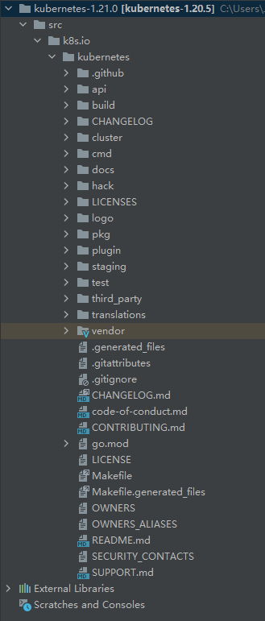
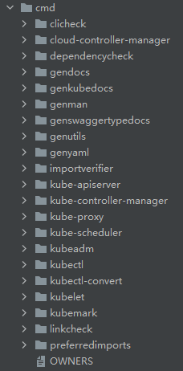
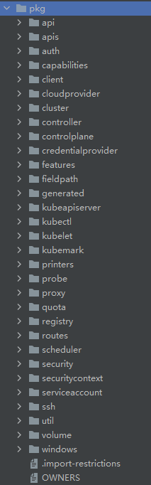
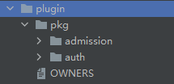

# Kubernetes源码目录结构

## 一、分类
Kubernetes的代码都在kubernetes目录下，如图，根据功能主要分成以下几类：

1、`文档类`（api、docs、logo）

2、`工具类`（build、cluster、hack、staging、translations）

3、`代码类`（cmd、pkg、plugin、test、third_party）

工具类主要用到的`build`目录下的文件，自己动手编译的时候会用到；核心代码集中在`cmd`和`pkg`中。

图1. k8s源码目录结构

## 二、核心目录
### （一）cmd目录
`cmd`内部包含各个组件的入口，具体核心的实现部分在`pkg`目录下，分别如图：

图2. k8s源码cmd目录

### （三）pkg目录

图3. k8s源码pkg目录

### （四）plugin目录
目前plugin主要包含的是`认证`与`鉴权`部分的代码。

图4. k8s源码plugin目录

## 参考
[1] https://juejin.cn/post/6844903795198001166