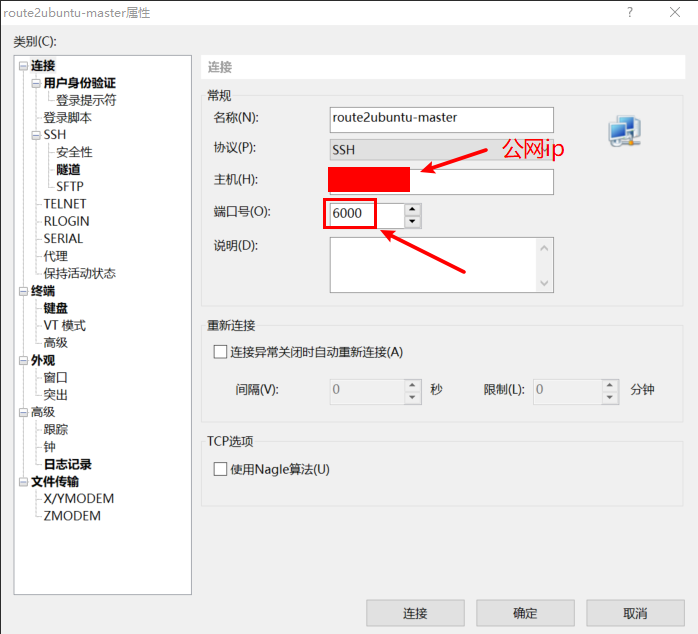
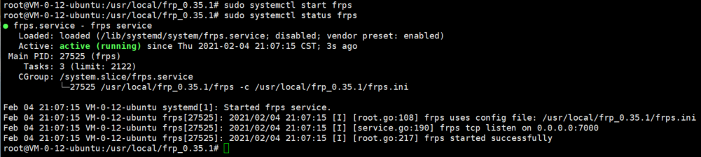

# frp实现内网穿透

## 准备一台公网服务器
笔者申请的是一台腾讯云服务器。

### 1、打开安全组相关端口

- 路径：控制台->安全组->修改规则->添加规则

- 来源：0.0.0.0/0

- 协议端口：
```
TCP:7000

TCP:6000

TCP:6001

TCP:6002
```

- 策略：允许

*注意：入站和出站均需添加。*

### 2、打开防火墙
```shell
# 启用
sudo ufw enable

# 开放端口
sudo ufw allow 7000
sudo ufw allow 6000
sudo ufw allow 6001
sudo ufw allow 6002

# 查看状态
sudo ufw status
```

## 下载frp
分别下载frp到公网服务器和内网服务器：
```shell
wget https://github.com/fatedier/frp/releases/download/v0.35.1/frp_0.35.1_linux_amd64.tar.gz
```

然后解压到`/usr/local`路径下
```shell
mkdir /usr/local/frp_0.35.1

tar -zxvf frp_0.35.1_linux_amd64.tar.gz -C /usr/local/frp_0.35.1 --strip-components 1
```

解压后路径`/usr/local/frp_0.35.1`内容如下
```shell
frpc  frpc_full.ini  frpc.ini  frps  frps_full.ini  frps.ini  LICENSE  systemd
```

*ps：`--strip-components 1 `表示跳过第一层目录进行解压*

## 配置公网服务器(frps:frp服务端)
修改 frps.ini 文件，这里使用了最简化的配置，设置了 frp 服务器用户接收客户端连接的端口：
```shell
vim /usr/local/frp_0.35.1/frps.ini

[common]
bind_port = 7000 # 这个是公网服务器的端口,我购买的是tecent云的服务器,其安全策略里面得设置开放此端口
```

## 配置内网服务器(frpc:frp客户端)
在需要被访问的内网机器上（SSH 服务通常监听在 22 端口）部署 frpc，修改 frpc.ini 文件，假设 frps 所在服务器的公网 IP 为` x.x.x.x`

且由于有三台内网机器同时以同一台公网机器作为跳板机，所以这三台内网机器的client名称需要不同，即`frpc.ini`中的`[ssh]`需要分别设置为`[ssh1]`、`[ssh2]`、`[ssh3]`，以示区分。

且这里三台服务器的`remote_port`分别配置为`6000`、`6001`、`6002`。否则会出现端口被占用，导致无法正常连接到内网机器的情况。

内网机器1：
```shell
vim /usr/local/frp_0.35.1/frpc.ini

[common]
server_addr = x.x.x.x
server_port = 7000 # 在公网开放的端口

[ssh1] # 这里是client的一个别名，命名为ssh1以和其他client区分
type = tcp
local_ip = 127.0.0.1
local_port = 22
remote_port = 6000 # 这个是公网服务器的端口,安全策略里面也得设置开放此端口
```

内网机器2：
```shell
vim /usr/local/frp_0.35.1/frpc.ini

[common]
server_addr = x.x.x.x
server_port = 7000 # 在公网开放的端口

[ssh2] # 这里是client的一个别名，命名为ssh1以和其他client区分
type = tcp
local_ip = 127.0.0.1
local_port = 22
remote_port = 6001 # 该端口需与其他内网机器所配置的端口不同
```

内网机器3：
```shell
vim /usr/local/frp_0.35.1/frpc.ini

[common]
server_addr = x.x.x.x
server_port = 7000 # 在公网开放的端口

[ssh3] # 这里是client的一个别名，命名为ssh1以和其他client区分
type = tcp
local_ip = 127.0.0.1
local_port = 22
remote_port = 6002 # 该端口需与其他内网机器所配置的端口不同
```

`local_ip `和` local_port `配置为本地需要暴露到公网的服务地址和端口。`remote_port `表示在` frp 服务端`监听的端口，访问此端口的流量将会被转发到本地服务对应的端口。

## 分别启动内网公网服务器FRP

### 1、在公网服务器上启动frps服务端
为了方便调试，我们先启动终端版：
```shell
cd /usr/local/frp_0.35.1/
./frps -c ./frps.ini
nohup ./frps -c ./frps.ini &

# 链接成功会出现如下内容
# 2021/02/04 00:09:17 [I] [root.go:108] frps uses config file: ./frps.ini
# 2021/02/04 00:09:17 [I] [service.go:190] frps tcp listen on 0.0.0.0:7000
# 2021/02/04 00:09:17 [I] [root.go:217] frps started successfully
```

生产使用中可使用如下命令在后台运行：
```shell
nohup ./frps -c ./frps.ini > /dev/null 2>&1 &
```

### 2、在内网服务器中启动frpc客户端：
公网服务器启动成功后，在内网服务器中启动frpc,为了方便调试，我们一样启动终端版：
```shell
cd /usr/local/frp_0.35.1/
./frpc -c ./frpc.ini
nohup ./frpc -c ./frpc.ini &

# 链接成功会出现如下内容
# 2021/02/04 00:11:47 [I] [service.go:290] [64276cca09e4f64c] login to server success, get run id [64276cca09e4f64c], server udp port [0]
# 2021/02/04 00:11:47 [I] [proxy_manager.go:144] [64276cca09e4f64c] proxy added: [ssh]
# 2021/02/04 00:11:48 [I] [control.go:180] [64276cca09e4f64c] [ssh] start proxy success
```
生产使用中可使用如下命令在后台运行：
```shell
nohup ./frpc -c ./frpc.ini > /dev/null 2>&1 &
```

## ssh登录服务器
如果配置成功，在进入本地服务器就相对容易了：
```shell
# 标准的ssh命令如下
ssh -p 600x root@xx.xx.xx.xx(公网IP)

# XShell支持的ssh命令不标准，应该通过如下命令连接，这个命令才会弹出让你保存密钥的浮窗：
ssh root@xx.xx.xx.xx(公网IP) 6000
```

也可以配置XShell的连接如下


## 关闭frp进程
这里以frp客户端为例，frp服务端同理。

### 1、找到frp进程
```shell
ps -aux|grep frp| grep -v grep
root      3600  0.1  0.1 110188  9484 pts/0    Sl   15:04   0:00 ./frpc -c ./frpc.ini
```
进程号是`3600`

*`grep -v grep`是为了去除包含`‘grep’`的记录,`-v`代表反转查找*

### 2、kill该进程
```shell
# 命令格式：kill -9 <pid>
kill -9 3600
```

## 配置systemctl来控制frps
### 1、创建frps.service
```shell
sudo vim /lib/systemd/system/frps.service
```

### 2、在frps.service里添加以下内容
```shell
[Unit]
Description=frps service
After=network.target syslog.target
Wants=network.target

[Service]
Type=simple
#启动服务的命令（此处写你的frps的实际安装目录）
ExecStart=/usr/local/frp_0.35.1/frps -c /usr/local/frp_0.35.1/frps.ini

[Install]
WantedBy=multi-user.target
```

*注意"ExecStart="之后的路径要填写你的frps安装路径(本文以安装到/usr/local/为例)*

## 3、使用systemctl命令来控制frps
启动frps
```shell
sudo systemctl start frps
```

服务器开机自动启动frps
```shell
sudo systemctl enable frps
```

重启frps
```shell
sudo systemctl restart frps
```

停止frps
```shell
sudo systemctl stop frps
```

查看日志
```shell
sudo systemctl status frps
```

如下图所示，已可以通过systemctl来启动并查看frps的状态


frpc的systemctl配置同理，具体如下小节所示。
## 配置systemctl来控制frpc
### 1、创建frpc.service
```shell
sudo vim /lib/systemd/system/frpc.service
```

### 2、在frpc.service里添加以下内容
```shell
[Unit]
Description=frpc service
After=network.target syslog.target
Wants=network.target

[Service]
Type=simple
#启动服务的命令（此处写你的frps的实际安装目录）
ExecStart=/usr/local/frp_0.35.1/frpc -c /usr/local/frp_0.35.1/frpc.ini

[Install]
WantedBy=multi-user.target
```

*注意"ExecStart="之后的路径要填写你的frpc安装路径(本文以安装到/usr/local/为例)*

## 3、使用systemctl命令来控制frpc
启动frpc
```shell
sudo systemctl start frpc
```

服务器开机自动启动frps
```shell
sudo systemctl enable frpc
```

重启frps
```shell
sudo systemctl restart frpc
```

停止frps
```shell
sudo systemctl stop frpc
```

查看日志
```shell
sudo systemctl status frpc
```

## 常见问题

如果连接不上，建议在命令行启动frp服务端、客户端后观察终端的输出，对报错、警告进行逐一分析。

### 1、token不匹配
```shell
[root@localhost frp_0.33.0_linux_amd64]# ./frpc -c ./frpc.ini
2020/06/24 15:35:02 [E] [service.go:273] token in login doesn't match token from configuration
2020/06/24 15:35:02 [W] [service.go:101] login to server failed: token in login doesn't match token from configuration
token in login doesn't match token from configuration
```
解决办法：

(1) 删除或注释掉frp客户端的frpc.ini文件中的`token = 12345678`

(2) 重启frp客户端

### 2、[ssh]名被占用
```shell
proxy name [ssh] is already in use
```

解决办法：

frp客户端的`frpc.ini`文件中的`[ssh]`修改为`[ssh1]`或其他你想要的命名，这只是一个别名而已，所以怎么命名都ok。

## 参考
[1]frp官方文档[https://gofrp.org/docs]

[2]Linux服务器所以Frp实现内网穿透(阿里云Ubuntu)[https://www.cnblogs.com/xlchan/p/13643231.html]：主要参考其整体方案

[3]frp后台运行和停止[https://blog.csdn.net/weixin_34244102/article/details/88677915]：主要参考xshell如何ssh命令行连接

[4]0001_20190327_使用frp搭建内网穿透[https://www.cnblogs.com/wxylog/p/10611632.html]：主要参考其token不匹配的解决方案

[5]frp -- proxy name [ssh] is already in use[https://blog.csdn.net/weixin_33840661/article/details/85948513]：主要参考其[ssh]被占用的解决方案

[6]阿里云服务器实现 FRP 内网穿透[https://www.freesion.com/article/776471384/]：主要参考其多客户端配置

[7]Linux安装配置Frp内网穿透教程[https://www.tok9.com/archives/488/]：主要参考其systemctl配置