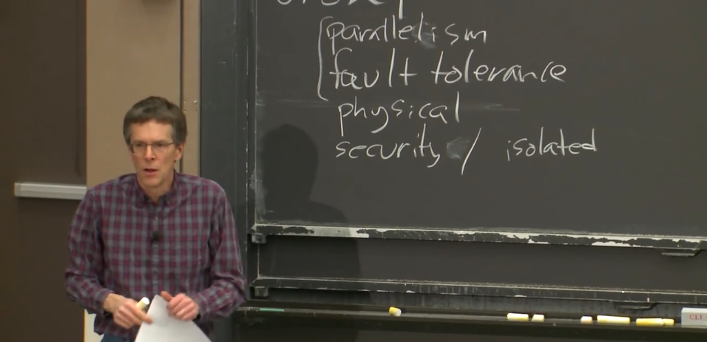

# 1.1分布式系统介绍——驱动力与挑战

这是6.824分布式系统课程，我会开始用简明的介绍我所认为的分布式系统。

分布式系统的核心是通过网络以完成一致任务的一组协作计算机。

因此我们将在本课程中重点介绍各种实例，例如大型网站的存储或MapReduce等大数据计算之类的东西，还有一些更奇特的事情，例如点对点文件共享，这些都只是我们研究分布式系统过程中的一些示例。

所有这些都很重要的原因是，许多重要的基础设施都是建立在分布式系统基础架构之上的。它们需要一台以上的计算机来完成工作，或者它本身就需要物理上被分散在多台计算机上。

在我讨论分布式系统之前，我需要提醒你的是，如果你要重新设计系统，则需要解决一些问题。如果你可以用一台计算机解决以上问题，而无需构建分布式系统，你应该采取单机的方式，这种方案可以完成很多工作，且总是更容易的。所以在构建分布式系统之前你应该尝试其他方案，因为分布式系统并不简单。

人们之所以需要使用多台联合的计算机，是因为以下原因：
- 他们需要获得更高的性能（high performance）。因为大量的计算机意味着大量的并行运算（parallelism），大量的CPU、内存、磁盘臂会并行运行着。
- 另一个人们构建分布式系统的原因是，它可以提供容错（fault tolerance），如果有两台计算机执行着同一个任务，其中一台发生故障，您可以切换到另一台。
- 第三个原因是，一些问题是天然在空间上分布的（physical）。例如你所知道的银行间转账，银行A在纽约有一台计算机，银行B在伦敦有一台计算机，你知道你必须为他们提供一些方式相互交流并合作以实现目标。所以有一些天然的原因导致系统是物理分布的。
- 人们建造分布式系统的最终目的是为了达到某种安全目标（security）。比如有些代码不被信任，但是你又需要和它进行交互，这些代码不会立即表现出恶意或表现出bug。你不会想要信任这些代码，你可能想拆分计算，这样那些不信任代码在那台计算机运行，我的代码在这台计算机上运行，他们只能通过某种狭窄定义的网络协议互相交谈。假设我们可能会担心你所知道的安全性，我们可以把系统拆分成多台计算机，以此相互隔离（isolated）。

本课程的大部分将与性能（performance）和容错（fault tolerance）有关。另外两点我们会通过对某些案例的研究来学习。

你知道所有这些分布式系统有很多困难（挑战）：
- 因为他们有很多部分，且这些部分是同时执行的，在多台计算机上，你会遇到**并发编程(concurrency)、复杂交互、以及时间依赖**所带来的所有问题，这是让分布式系统变得困难的一点原因。
- 另一点让分布式系统变得困难的原因是因为你拥有多个组件，再加上计算机网络，你可能会遇到意想不到的故障。如果你只有一台计算机，通常情况是计算机可以正常工作，或者完全宕机，或者遭受电源故障或某些故障，即要么可以完全正常工作要么完全不工作。由许多计算机组成的分布式系统，可能是一部分组件在工作，一部分组件停止工作，或者这些计算机都在正常运行，但是网络的某些部分中断了或是不稳定。因此，**部分故障** （partial failures）是分布式系统困难的另一个原因。
- 造成分布式系统困难的最后一个原因，人民构建分布式系统的最初原因通常是为了获得更高的性能，比如说一千台计算机或一千个磁盘臂的性能，但实际上一千台计算机能获得多少性能是一个棘手的问题，通常有很多障碍挡在你的路上，所以通常需要小心地设计才能使系统真正达到你期望的性能。

因此，本课程就是为了解决这些问题。通常，问题和解决方案在技术上都很有趣，对于其中一些困难的问题，有很好的解决方案，而其他一些问题在现有的分布式系统则没有很好的解决方案。

现在分布式系统被用在现实世界的许多系统中，例如大型网站通常由大量计算机构成的分布式系统来运行。

我刚开始教这门课的时候，分布式系统是一种学术上的好奇心。人们有时候小规模地使用它，且预感在未来某一天可能会很重要。但现在特别受巨型网站的兴起所驱动，出现了大量的数据和大型数据中心。

在过去的二十年中，分布式系统已经变成计算机基础架构非常重要的组成部分，这意味着分布式系统已经引起了人们很多关注，且已经解决了很多问题，但是有很多未解决的问题，所以如果你是一名研究生，或你对研究感兴趣，还有很多需要使用分布式系统解决的问题，以及进行相关研究。

最后，如果你喜欢动手，这是一门很好的课程，因为它有一系列实验，你将构建一些贴近现实，关注性能和容错的分布式系统。所以你会有很多机会练习构建分布式系统，并使它们正常运行。