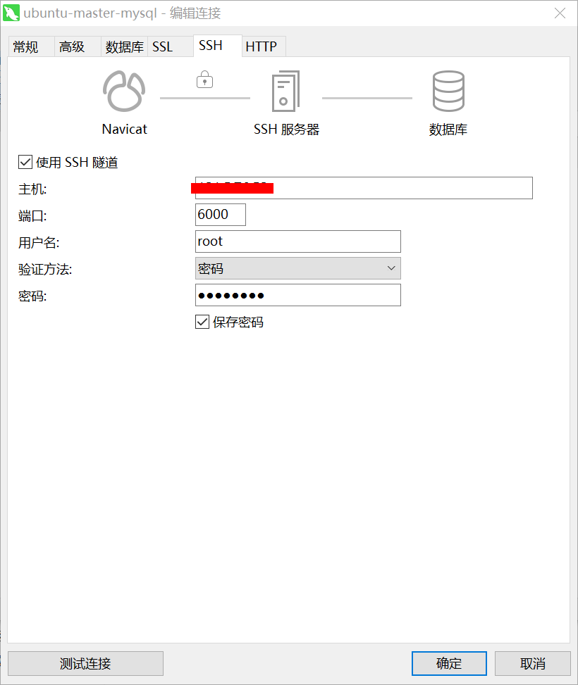
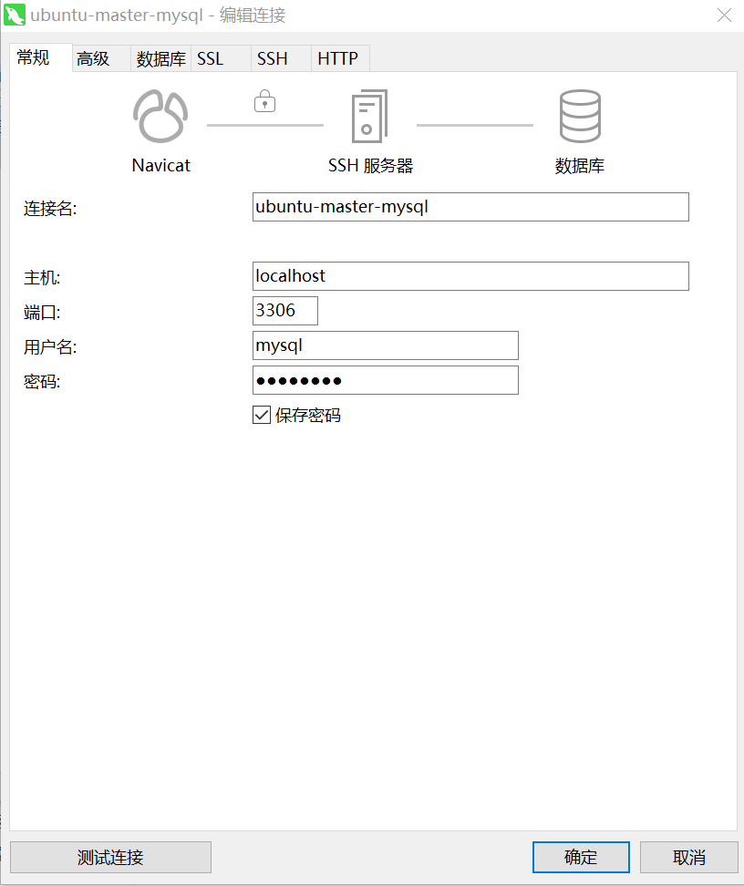

# 20210207_通过跳板机访问内网MySQL数据库

## 一、工具
- Navicate
- 一台安装了frps的公网跳板机
- 一台安装了frpc的内网MySQL服务器

> 附：frp内网穿透详细搭建指引：[20210203_frp实现内网穿透.md](https://github.com/JasonCeng/JasonCengBlog/blob/main/Linux/20210203_frp%E5%AE%9E%E7%8E%B0%E5%86%85%E7%BD%91%E7%A9%BF%E9%80%8F.md)

## 二、SSH配置
- 主机：公网跳板机ip
- 端口：内网MySQL服务器与公网跳板机的通讯端口（详见frp内网穿透指引）
- 用户名/密码：登录内网MySQL服务器的用户名/密码

## 三、常规配置
- 连接名：自定义
- 端口：MySQL开放端口
- 用户名/密码：登录MySQL数据库的用户名/密码
