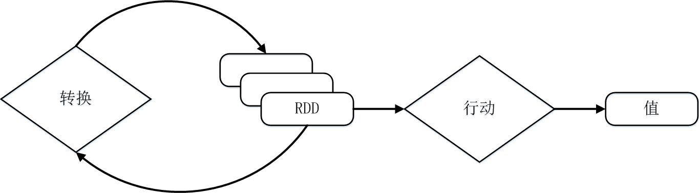
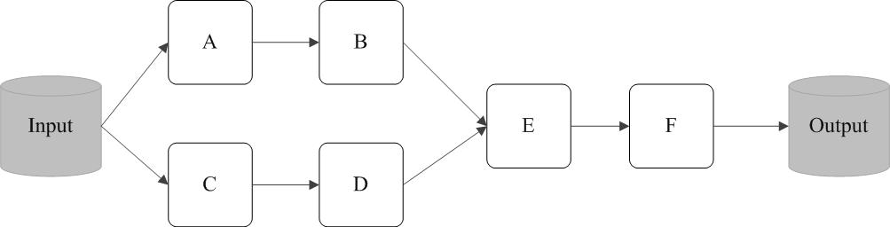

# RDD原理详解

## 一、RDD的起源与背景
RDD的设计理念源自AMP实验室发表的论文《Resilient Distributed Datasets: A Fault-Tolerant Abstraction for In-Memory Cluster Computing》

在实际应用中，存在许多迭代式算法（比如机器学习、图算法等）和交互式数据挖掘工具，这些应用场景的共同之处是，不同计算阶段之间会重用中间结果，即一个阶段的输出结果会作为下一个阶段的输入。

但是，目前的MapReduce框架都是把中间结果写入到HDFS中，带来了大量的数据复制、磁盘IO和序列化开销。

虽然，类似Pregel等图计算框架也是将结果保存在内存当中，但是，这些框架只能支持一些特定的计算模式，并没有提供一种通用的数据抽象。

RDD就是为了满足这种需求而出现的，它提供了一个抽象的数据架构，我们不必担心底层数据的分布式特性，只需将具体的应用逻辑表达为一系列转换处理，不同RDD之间的转换操作形成依赖关系，可以实现管道化，从而避免了中间结果的存储，大大降低了数据复制、磁盘IO和序列化开销。

## 二、RDD的概念
RDD（Resilient Distributed Datasets弹性分布式数据集），本质上是一个只读的分区记录集合，每个RDD可以分成多个分区，每个分区就是一个数据集片段，并且一个RDD的不同分区可以被保存到集群中不同的节点上，从而可以在集群中的不同节点上进行并行计算。

RDD提供了一种高度受限的共享内存模型，即RDD是只读的记录分区的集合，不能直接修改，只能基于稳定的物理存储中的数据集来创建RDD，或者通过在其他RDD上执行确定的转换操作（如map、join和groupBy）而创建得到新的RDD。

## 三、RDD的两种操作
RDD提供了一组丰富的操作以支持常见的数据运算，分为“行动”（Action）和“转换”（Transformation）两种类型，前者用于执行计算并指定输出的形式，后者指定RDD之间的相互依赖关系。两类操作的主要区别是，转换操作（比如map、filter、groupBy、join等）接受RDD并返回RDD，而行动操作（比如count、collect等）接受RDD但是返回非RDD（即输出一个值或结果）。

RDD提供的转换接口都非常简单，都是类似map、filter、groupBy、join等粗粒度的数据转换操作，而不是针对某个数据项的细粒度修改。因此，RDD比较适合对于数据集中元素执行相同操作的批处理式应用，而不适合用于需要异步、细粒度状态的应用，比如Web应用系统、增量式的网页爬虫等。

## 四、Spark中对RDD的实现
Spark用Scala语言实现了RDD的API，程序员可以通过调用API实现对RDD的各种操作。RDD典型的执行过程如下：

1、RDD读入外部数据源（或者内存中的集合）进行创建；

2、RDD经过一系列的“转换”操作，每一次都会产生不同的RDD，供给下一个“转换”使用；

3、最后一个RDD经“行动”操作进行处理，并输出到外部数据源（或者变成Scala集合或标量）。

## 五、RDD的惰性调用原理
RDD采用了**惰性调用**，即在RDD的执行过程中（如图9-8所示），真正的计算发生在RDD的“行动”操作，对于“行动”之前的所有“转换”操作，Spark只是记录下“转换”操作应用的一些基础数据集以及RDD生成的轨迹，即相互之间的依赖关系，而不会触发真正的计算。


<center>图1.Spark的转换和行动操作</center>


例如，在图2中，从输入中逻辑上生成A和C两个RDD，经过一系列“转换”操作，逻辑上生成了F（也是一个RDD），之所以说是逻辑上，是因为这时候计算并没有发生，Spark只是记录了RDD之间的生成和依赖关系。当F要进行输出时，也就是当F进行“行动”操作的时候，Spark才会根据RDD的依赖关系生成DAG，并从起点开始真正的计算。


<center>图2.RDD执行过程的一个实例</center>

上述这一系列处理称为一个“血缘关系（Lineage）”，即DAG拓扑排序的结果。采用惰性调用，通过血缘关系连接起来的一系列RDD操作就可以实现管道化（pipeline），避免了多次转换操作之间数据同步的等待，而且不用担心有过多的中间数据，因为这些具有血缘关系的操作都管道化了，一个操作得到的结果不需要保存为中间数据，而是直接管道式地流入到下一个操作进行处理。

同时，这种通过血缘关系把一系列操作进行管道化连接的设计方式，也使得管道中每次操作的计算变得相对简单，保证了每个操作在处理逻辑上的单一性；相反，在MapReduce的设计中，为了尽可能地减少MapReduce过程，在单个MapReduce中会写入过多复杂的逻辑。

## 六、一个Spark的“Hello World”程序
这里以一个“Hello World”入门级Spark程序来解释RDD执行过程，这个程序的功能是读取一个HDFS文件，计算出包含字符串“Hello World”的行数。

```scala
val sc= new SparkContext(“spark://localhost:7077”,”Hello World”, “YOUR_SPARK_HOME”,”YOUR_APP_JAR”)
val fileRDD = sc.textFile(“hdfs://192.168.0.103:9000/examplefile”)
val filterRDD = fileRDD.filter(_.contains(“Hello World”))
filterRDD.cache()
filterRDD.count()
```
可以看出，一个Spark应用程序，基本是基于RDD的一系列计算操作。

第1行代码用于创建SparkContext对象；第2行代码从HDFS文件中读取数据创建一个RDD；第3行代码对fileRDD进行转换操作得到一个新的RDD，即filterRDD；第4行代码表示对filterRDD进行持久化，把它保存在内存或磁盘中（这里采用cache接口把数据集保存在内存中），方便后续重复使用，当数据被反复访问时（比如查询一些热点数据，或者运行迭代算法），这是非常有用的，而且通过cache()可以缓存非常大的数据集，支持跨越几十甚至上百个节点；第5行代码中的count()是一个行动操作，用于计算一个RDD集合中包含的元素个数。

这个程序的执行过程如下：
* 创建这个Spark程序的执行上下文，即创建SparkContext对象；
* 从外部数据源（即HDFS文件）中读取数据创建fileRDD对象；
* 构建起fileRDD和filterRDD之间的依赖关系，形成DAG图，这时候并没有发生真正的计算，只是记录转换的轨迹；
* 执行到第5行代码时，count()是一个行动类型的操作，触发真正的计算，开始实际执行从fileRDD到filterRDD的转换操作，并把结果持久化到内存中，最后计算出filterRDD中包含的元素个数。

## 七、RDD实现高效计算的原因
总体而言，Spark采用RDD以后能够实现高效计算的主要原因如下：

### 1、高效的容错性

现有的分布式共享内存、键值存储、内存数据库等，为了实现容错，必须在集群节点之间进行数据复制或者记录日志，也就是在节点之间会发生大量的数据传输，这对于数据密集型应用而言会带来很大的开销。

在RDD的设计中，数据只读，不可修改，如果需要修改数据，必须从父RDD转换到子RDD，由此在不同RDD之间建立了血缘关系。所以，RDD是一种天生具有容错机制的特殊集合，不需要通过数据冗余的方式（比如检查点）实现容错，而只需通过RDD父子依赖（血缘）关系重新计算得到丢失的分区来实现容错，无需回滚整个系统，这样就避免了数据复制的高开销，而且重算过程可以在不同节点之间并行进行，实现了高效的容错。此外，RDD提供的转换操作都是一些粗粒度的操作（比如map、filter和join），RDD依赖关系只需要记录这种粗粒度的转换操作，而不需要记录具体的数据和各种细粒度操作的日志（比如对哪个数据项进行了修改），这就大大降低了数据密集型应用中的容错开销。

### 2、中间结果持久化到内存

数据在内存中的多个RDD操作之间进行传递，不需要“落地”到磁盘上，避免了不必要的读写磁盘开销。

### 3、存放的数据可以是Java对象

避免了不必要的对象序列化和反序列化开销。